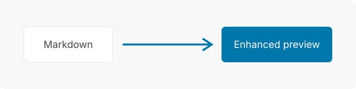
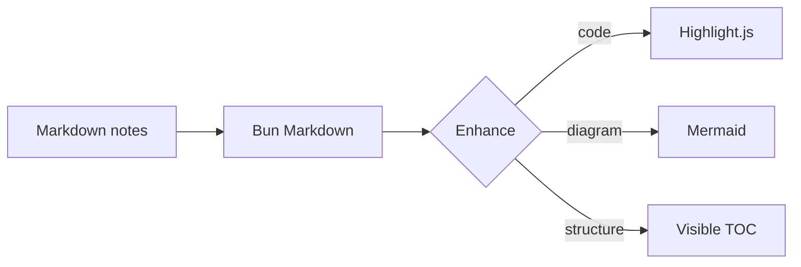

# Notæ rendering fixture

This page exercises the browser-side enhancements. Jump to [the diagram](#diagram),
open the [nested document](linked.md#destination), or inspect the local image below.



## Typography

Plain text with **bold**, *italic*, ~~strikethrough~~, `inline code`, and a
[remote link](https://example.com). The page deliberately has enough sections
to exercise active and visible table-of-contents states.

> A block quotation with a nested list:
>
> - first item
> - second item

<details>
<summary>Rendering notes</summary>

The drawer should have a bordered surface and a distinct summary bar.

</details>

## Sortable and resizable table

| Name | Count | Language |
|:-----|------:|:---------|
| gamma | 300 | Rust |
| alpha | 10 | JavaScript |
| beta | 2 | Python |

The headers sort in both directions. Their right edges can be dragged or moved
with the arrow keys while the separator has focus.

## Highlighted code

```javascript
const documents = ["notes.md", "journal.md"];
console.log(documents.map((name) => name.toUpperCase()));
```

```python
from pathlib import Path

markdown_files = sorted(Path.cwd().rglob("*.md"))
```

## Diagram



## A long section heading that wraps instead of being truncated

This section provides vertical space so several headings can enter and leave
the viewport independently. The TOC uses a pale marker for every visible
heading and a stronger marker for the current section.

Lorem ipsum dolor sit amet, consectetur adipiscing elit. Integer posuere erat
a ante venenatis dapibus posuere velit aliquet. Donec ullamcorper nulla non
metus auctor fringilla. Vestibulum id ligula porta felis euismod semper.

Curabitur blandit tempus porttitor. Maecenas faucibus mollis interdum. Nullam
quis risus eget urna mollis ornare vel eu leo. Aenean lacinia bibendum nulla
sed consectetur.

### Nested section

Repeated heading names must still receive stable, unique anchors.

### Nested section

This second heading should end in a numeric suffix.

## Final section

The end of the rendering fixture.
